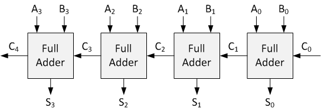
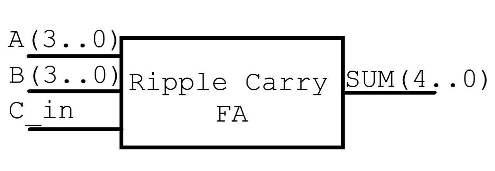
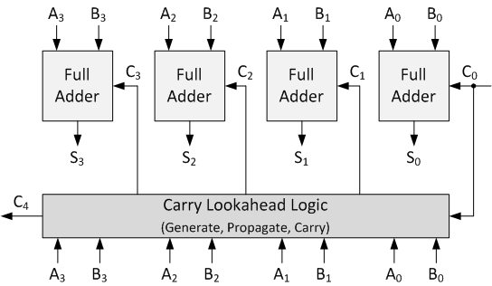

# 4bit ripple-carry adder

[Wikipedia ripple-carry adder](https://en.wikipedia.org/wiki/Adder_(electronics)#Ripple-carry_adder).

We can use the structural approach and connect 4 single bit full-adders accordingly with this figure:



Our design will handle 4 signal vectors: A, B, S 4bit and C 5bit. The output can be written as C(4)&S, the concatenation of the last element of the Carry vector and the entire Sum vector.

## Implementation:
- First of all, create a new folder in which you put the source of your single bit full-adder.
- Create a new VHDL design file and start declaring the entity with 4 ports like in figure


- The design needs two internal signals one of which for the carry `C(4..0)` and another one for the internal for the sum `S(3..0)` (refer to the first picture)
- Start the architecture and declare this two signals;
- map the ports of 4 single bit full_adder by using `entity work."YOUR FULL ADDER DESIGN" port map`
- follow this template

```
YOUR DSIGN IN1 => A(0),
YOUR DSIGN IN2 => B(0),
YOUR DSIGN CarryIN => C(0),
YOUR DSIGN OUTPUT => S(0),
YOUR DSIGN CarryOUT => C(1)
```
- Assign to the port SUM the value of the concatenation C(4)&S and end the architecture.
- Save and analyze

There are two TBs in the folder ripple_adder. They follows two totally different approaches in the generation of the stimuli. One is forcefully more hardware oriented while the other one uses a much synthetic and clever procedural approach. The 2 codes are commented.


# 4bit carry-lookahead adder 

[Wikipedia carry-lokahead adder](https://en.wikipedia.org/wiki/Carry-lookahead_adder)

This adder use a different logic to infer the value of the carry bits.



Carry-lookahead logic uses the concepts of generating (G) and propagating (P) carries.

## Implementation:
- As for the precious example, create a new folder in which you put the source of your single bit full-adder.
- Create a new VHDL design file starting from the ripple-carry adder. Only change its entity name because they share the same ports (and functionality)
- The design needs two internal signals on top of the previous design, the Generate `G(3..0)` and the Propagate `P(3..0)` vectors
- Copy the previous architecture and declare this two additional signals;
- map the ports of 4 single bit full_adder by using `entity work."YOUR FULL ADDER DESIGN" port map`. This time, leave the carry out ports of the single bit full adders open
- follow this template

```
YOUR DSIGN IN1 => A(0),
YOUR DSIGN IN2 => B(0),
YOUR DSIGN CarryIN => C(0),
YOUR DSIGN OUTPUT => S(0),
YOUR DSIGN CarryOUT => open
```
- Create the Generate vector following the formula Gi=Ai*B1
```
G(0)<=a(0) and b(0);
```
- Create the Propagate vector following the formula Pi=Ai+B1
```
P(0)<=a(0) or b(0);
```
- To evaluate the carry out you need to solve these equations C(i+1)=Gi+(Pi*Ci)
```
C(0)<=c_in;
C(1)<=G(0) or (P(0) and c(0));
...
```
- Assign to the port SUM the value of the concatenation C(4)&S and end the architecture.
- Save and analyze

# nbit Ripple-carry Full Adder


