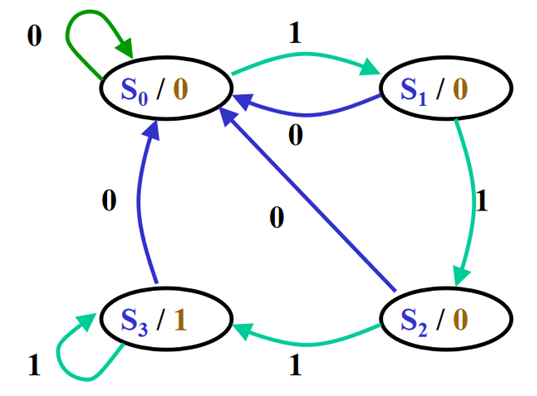
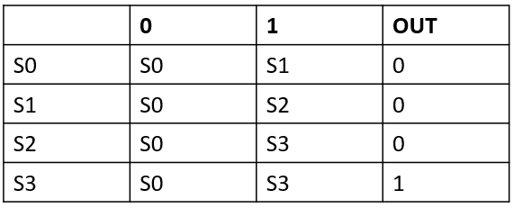

# Binary to 7-segment display


[Wikipedia 7-semgent display](https://en.wikipedia.org/wiki/Seven-segment_display)

In this exercise we will create a 7-segment display driver that allows a 4bit binary number to be displayed.

## Implementation

- Create a new folder and start a new VHDL file declaring the entity to have 2 inputs (clk, binary input (3..0)) and 7 single bit output, one for each segment
- The idea is to encode the binary input number following the hexadecimal scheme of the table (abcdefg)
- Even though we have 7 segments, we have to encode 8bit codes. For compactness we can put all these values in a single 8bit vector that has to be declared in the architecture
- We can use the case-when statement incapsulated in a process sensitive to the clock and the binary input
- With the case statement, we can describe all the possible combinations
```
 process (i_Clk, i_Binary_Num) is
  begin
    if rising_edge(i_Clk) then
      case i_Binary_Num is
        when "0000" => -- 0
          r_Hex_Encoding <= X"7E"; -- 0111 1110
        when "0001" => -- 1
          r_Hex_Encoding <= X"30"; -- 0011 0000
        when "0010" => -- 2
        ...
        ...
        when others => r_Hex_Encoding <= (others => 'X');
```
- Note that the keyword `others` may be used to refer to all elements not already mentioned
- Now we can end the case, the if (clk) and the process
- As concurrent statement now, we have to assign the 7 outputs to each element of the r_Hex_Encoding vector
```
o_Segment_A <= r_Hex_Encoding(6);
o_Segment_B <= r_Hex_Encoding(5);
o_Segment_C <= r_Hex_Encoding(4);
...
```
- The r_Hex_Encoding(7) is left unused
- End the architecture.

You will find a simple TB example in the binary_to_7seg folder.

# 8bit RAM 32 addresses

In this example I'll show you how to implement a 8bit RAM with 32 addresses. We can see it as a 32 by 8 matrix. We will use the `ARRAY` contruct. The Memory will have a port that enables the writing inside the RAM and onother one in charge of reading it. By using a 5bit address port as indexing, you can write and read all the RAM.

## Implementation

- Create a new folder and start a new VHDL file by declaring the entity to have this inputs: 3 single bit (clock, read enable and write enable), 1 5bit (the addresses), 1 8bit (the data to be stored) and 1 8bit output (data to be read)
- Start the architecture and define a new type as an array of 32 8bit std_logic_vector constituting the matrix. Declare a signal of this type and initialize it to zero:
```
TYPE mem IS ARRAY(0 TO 31) OF std_logic_vector(7 DOWNTO 0);
SIGNAL ram_block : mem:= (others => (others =>'0'));
```
- Create two synchronous processes (clk in the sensitivity list) one devoted to write inside the matrix and another one to read the elements of the matrix.
```
...
if (i_wen ='1') then
 ram_block(to_integer(unsigned(i_address)))<=i_data;
end if;...
...
if (i_ren ='1') then
 o_data<=ram_block(to_integer(unsigned(i_address)));
end if;..
...
```
- end the architecture.

You will find a simple TB example in the RAM8x32 folder.

# Variable vs Signal

In this example we will see the different behavior of variables and signals assignments. As presented during the classes, a variable in not always synthetized and could not have a physical counterpart. Another big difference is that a variable is immediately assigned in a sequential synchronous process while for a signal, the assignment will take 1 clk cycle.

To show this last point, we are going to implement a simple counter process where the value of both a variable and a signal is incremented by one. Once each counter reach a certain number, the design will output that the count is done (2 outputs, one for the signal and the other one for the variable).

## Implementation

- Create a new folder and tart a new VHDL file by declaring the entity with one input (clk) and the two "counters done" ountput (var_done and sign_done)
- Start the architecture and declare the count signal we want to evaluate. You can declare it as natural (we wont be using it as an output) with a limited size
```
signal r_Count    : natural range 0 to 6 := 0;
```
- Start the process and declare a variable of the same type and size of the signal
```
...
process (i_clk)
variable v_Count : natural range 0 to 6 := 0;
 begin
  ...
```
- Increase both counters at each clock cycle
- In the same process, implement two comparators one for each counters and describe the behavior of the 2 outputs
```
	-- Signal Checking

			if r_Count = 6 then
				o_Sig_Done <= '1';
				r_Count    <= 0;
			else
				o_Sig_Done <= '0';
			end if;

				-- Variable Checking
			
			if v_Count = 6 then
				o_Var_Done <= '1';
				v_Count := 0;
			else
				o_Var_Done <= '0';
			end if;
```
- End the process and the architecture.

The test bench is really simple. You just need to connect a clk source as a stimulus of this design.

# Finite state machine

In this last example we will implement the MOORE finite state machine that was described during a previous lesson. This state machine will recognize when a sequence of 3 consecutive 1 is detected.

By following the pictures we can describe the behavior of the machine





## Implementation

- Start a new VHDL file in a new folder and declare the entity for the finite state machine, add reset.
- In the architecture declare a new type made by the 4 states in the picture
- Declare two signals of this new type indicating the current and next states of the transition
- We will need 3 processes for this design
- start the first process sensitive to the clk and the reset. This is in charge of the transitions between current state and next state (when to go)
- When the reset is issued the machine has to be in S0 so the current state must be associated to S0
- In the other cases, when a rising edge of the clock is detected, at the current state must be associated the next state
- end this first process
-start a combinatory process sensitive to the current state and the input port. This is in charge of describing the transitions (where to go)
- start a case-when statement describing the behaviour of each state when a 1 or a 0 is detected in the input port like:
```
case current_state is
			when S0=>
			if in_port = '1' then
			next_state <= S1;
			else
			next_state <= S0;
			end if;
```
-End this process
- Start a new process sensitive to only the current state. This is in charge of the output
- Begin a case-when structure and describe the behaviour of the out port when the machine is in each of the four S states.

You will find a TB in the pattern_recog folder. If you use these names, you can try it in your design:

- source file entity: FSM
- FSM ports:
-clk : in
-in_port : in
-reset : in 
-out_port:out
The generated pattern is 
(Reset/in_port)= 1/0 , '0/1' , '0/0', '0/1', '0/1', '0/0', '0/1', '0/1', '0/1', '0/0', '0/1', '0/1', '0/1', '0/1',

